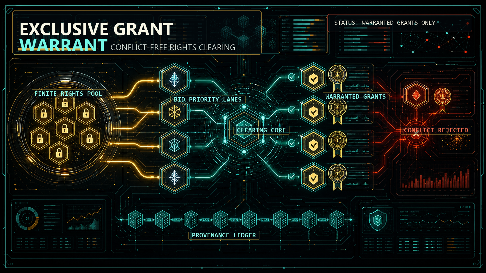

<p align="center">
  
</p>

# ExclusiveGrantWarrant

Deterministic clearing, conflict-free allocation, and per-grant provenance warrants for a finite pool of mutually-exclusive rights.

`ExclusiveGrantWarrant` answers one question:

> For this bidding round on a finite pool of mutually-exclusive rights, what is the conflict-free clearing allocation and clearing price, and is every granted right provenance-certified?

It accepts a JSON bidding round and returns one of three verdicts:

- `cleared`: every granted right is conflict-free, priced at the clearing price, and bound to a verified provenance warrant — and no bid is left unmet.
- `partial`: a valid allocation exists, but some bids are unmet or one evidence channel is thin.
- `void`: an exclusivity conflict leaves nothing grantable, no clearing price exists, or a granted right's provenance fails verification.

The engine is stdlib-only and deterministic. It does not call a network, system clock, or AI model in the verdict path.

## What makes it different

It is **not** a generic clearing marketplace. The goods being cleared are *exclusive, provenance-bound rights*:

1. **No right is granted twice.** Allocation is set-disjoint — a bid is granted only if *all* its requested rights are still free (atomic exclusive grant), in deterministic priority order.
2. **No grant is valid without a verified warrant.** Each granted right is bound to a hash-chained provenance warrant; if a granted right's attestation does not verify, the whole round is `void`.

Clearing is subordinate to non-double-allocation + per-grant provenance.

## Usage

```bash
# emit example rounds (cleared / partial / void)
python exclusive_grant_warrant.py sample --write examples

# machine JSON verdict
python exclusive_grant_warrant.py run examples/cleared.json

# human Markdown report
python exclusive_grant_warrant.py report examples/cleared.json

# append a hash-chained grant warrant to a ledger, then verify it
python exclusive_grant_warrant.py run examples/cleared.json --ledger warrants.jsonl
python exclusive_grant_warrant.py report --ledger warrants.jsonl
```

## Input shape

```json
{
  "round_id": "EGW-001",
  "rights_pool": ["band-A", "band-B", "band-C"],
  "bids": [
    {
      "bid_id": "b1",
      "holder": "acme",
      "rights": ["band-A", "band-B"],
      "price_per_unit": 12.0,
      "priority": 5,
      "provenance": {
        "holder_id": "acme",
        "evidence": ["license.pdf", "kyc.json"],
        "attestation_sha256": "1111...64hex"
      }
    }
  ]
}
```

- **Allocation** order: priority desc, then price desc, then bid_id asc (fully deterministic tie-break).
- **Clearing price** (average mechanism): the lowest accepted price, or the midpoint between the lowest accepted and the highest conflicting rejected price.
- **Warrant**: `sha256` over `{round_id, right, holder, bid_id, clearing_price, provenance_attestation_sha256}`.

## Output

`run` emits JSON with `verdict`, `clearing_price`, `allocation`, `unmet`, `warrants`, `reasons` (all failing channels — the engine never stops at the first failure), `component_scores`, and `commitments` (input/verdict/combined SHA-256). The same input always yields the same allocation, clearing price, and warrant hashes.

## Boundary

> This is not an exchange, not a rights registry of record, not a regulator, and not a price oracle — it clears one round of bids on a finite exclusive-rights pool and certifies each grant.

## Tests

```bash
python -m unittest discover -s tests
```

## Provenance

Generated by the [ProjectGenome](https://github.com/sadpig70/ProjectGenome) `recreate` method (run 009): a corpus-to-project genome compiler that recombines reusable parts from a project corpus into an auditable new project seed. Reused parts: average-mechanism clearing price (double-auction), set-disjoint exclusivity (spectrum allocation), priority allocation (ascending auction), and a per-grant provenance certificate (renewable-energy-certificate registry, redesigned from an NFT to a stdlib hash-chain warrant).

## License

[MIT](LICENSE) © 2026 Jung Wook Yang
